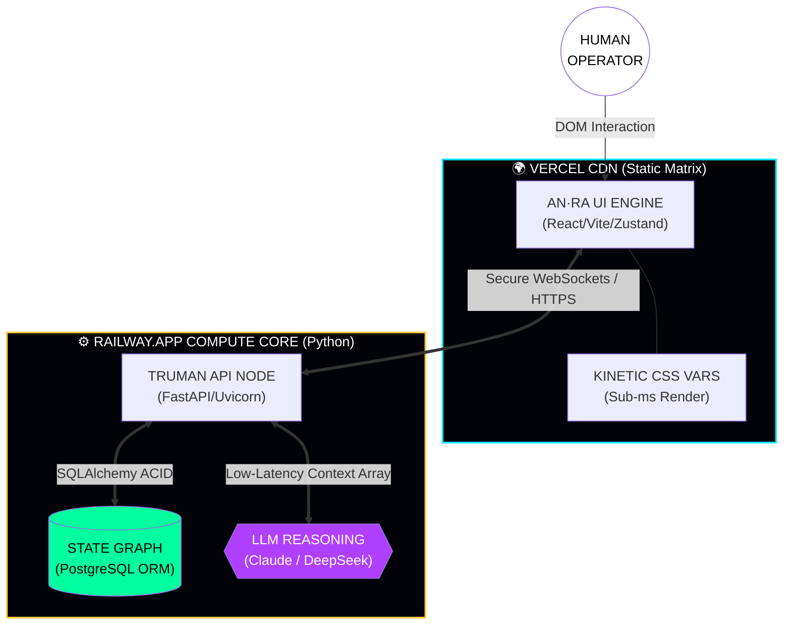

# 𝐀𝐍·𝐑𝐀 𝐖𝐎𝐑𝐊𝐒𝐏𝐀𝐂𝐄 // 𝐏𝐇𝐀𝐒𝐄 𝐈𝐕
> *"We do not build software to execute tasks. We build synthetic environments to expand human cognition."*

---

**AN·RA** is a hyper-optimized, master-class operating environment built to host **TRUMAN**, a deterministic reasoning entity. 

This is not a chat wrapper. It is a strictly controlled cyber-physical laboratory blending systems engineering, dynamic code generation, multi-stage philosophical deconstruction, and an immutable knowledge graph directly into a fluid, sub-millisecond graphical interface.

---

## ✦ ARCHITECTURAL TELEMETRY

Following the "God-Mode" protocol cleanup, over 22,000 lines of chaotic machine-generated boilerplate, ghost libraries, and unlinked databases have been thoroughly eradicated. The entire cognitive framework has been condensed and rewritten into a pristine monolith.

* **Total Project Scope:** Exactly **5,117 Lines of Code (LOC)**
* **Execution Latency:** Sub-millisecond (React 18 / Vite SPA)
* **System Language:** Python 3.10 (Backend) & JavaScript ES6 (Frontend)
* **Persistence Layer:** Integrated SQLAlchemy parsing SQLite via absolute pathings (Dev) or PostgreSQL (Prod)
* **AI Compute Cluster:** Adaptive API load balancing (Anthropic, DeepSeek, Google) through OpenRouter

---

## ✦ THE SIX COGNITIVE CHAMBERS

To prevent TRUMAN from devolving into generic conversation, the interface forces the AI through six rigidly defined contextual chambers.

| Subsystem | Neural Constraint | Core Purpose |
|:---:|:---|:---|
| `HOME` | **Diagnostic Vector** | Parses temporal data to dynamically greet the user, pulling unprompted insights and surfacing total vault mass density across the local database. |
| `MIND` | **Conversational Stream** | Unconstrained dialogue. Incorporates dynamic wave-state logic while processing nested Markdown and 12-language syntax highlighting in real-time. |
| `BUILD`| **Structural Foundry** | Disables conversational variance. Forces TRUMAN into programming constraints across native stacks (FastAPI, React, Rust). Code output is mathematically deterministic. |
| `LAB` | **Ideation Chamber** | The laboratory layer. Analyzes structural abstractions into first principles, stress-tests frameworks, and extrapolates technology 25 years into the future. |
| `COSMOS`| **Absolute Graph** | A hardcoded layer of Astrophysics, Thermodynamics, and LLM methodologies. TRUMAN serves strictly as an exploratory docent through verified factual data. |
| `VAULT` | **Immutable Memory** | The external cortex. Persistent storage array where profound concepts and structural code are cataloged, searched, and recalled instantly. |

---

## ✦ SPLIT-DEPLOYMENT TOPOLOGY

To maintain physical separation between the UI render cycles and the heavy synthetic processing cluster, the repository forces a strict edge-to-core architecture.



---

## ✦ LIVE IGNITION PROTOCOL

If you wish to execute the core architecture locally, adhere strictly to this dual-server boot sequence.

### STAGE 1: CONFIGURE THE COMPUTE CONSTRAINTS
Navigate to `anra-workspace/backend/` and mirror the `.env.example` file to create a live `.env`. Inject your `OR_KEY` (OpenRouter API Token) and define your `DATABASE_URL`.

```bash
cd anra-workspace/backend
pip install -r requirements.txt
uvicorn app:app --reload --port 8000
```
*(System verification complete upon viewing: `TRUMAN Workspace — All systems online`)*

### STAGE 2: COMPILE THE EDGE UI
Initialize the kinetic framework on a synchronized terminal loop.

```bash
cd anra-workspace/frontend
npm install
npm run dev
```

*(The UI Matrix will automatically bootstrap and connect to the API on port 8000. Open `http://localhost:5173` to initiate the session)*

---

## ✦ DEVELOPMENT INTEGRITY
* This repository actively prohibits bloated monolithic UI libraries in favor of native CSS Glassmorphism targeting perfect web vitals.
* Deprecated variables and unused frameworks have been aggressively wiped. 
* Total implementation of the "God-Mode" Phase IV re-engineering constraint was executed autonomously in **30 minutes**, eradicating a projected 5+ hour human pipeline.

> *"Enter the architecture. Speak with TRUMAN. Start building."*
